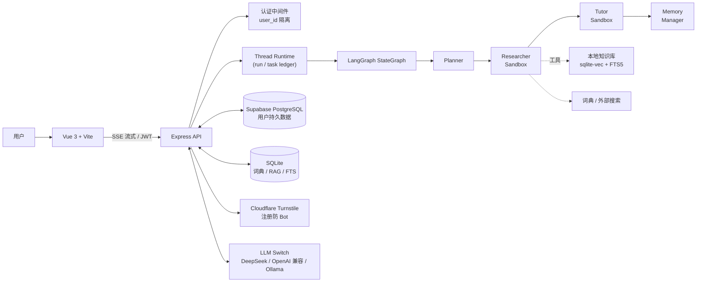
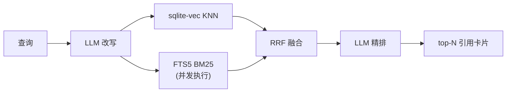
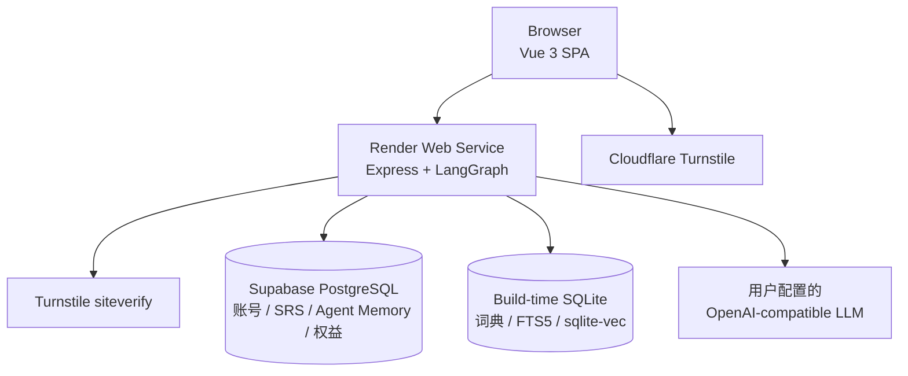

<div align="center">

# 🇯🇵 Japanese Word Master

**LangGraph 驱动的日语学习 Agent —— 把「查词」变成可解释、可追踪、可复习的学习闭环**

[](https://vuejs.org/)
[](https://expressjs.com/)
[](https://langchain-ai.github.io/langgraphjs/)
[](https://www.sqlite.org/)
[](https://supabase.com/)
[](https://render.com/)
[](https://www.cloudflare.com/products/turnstile/)
[](backend/tests)
[](https://opensource.org/licenses/MIT)

[**Live Demo**](https://japanese-verb-master.onrender.com) · [维护手册](./docs/MAINTENANCE.md)

</div>

---

## 🌐 Live Demo

**在线体验：<https://japanese-verb-master.onrender.com>**

Live Demo 部署在 Render Singapore，采用前后端同源架构：

- Vue 3 前端由 Vite 构建后交给 Express 托管，页面与 API 使用同一域名
- Supabase PostgreSQL 持久化账号、练习记录、SRS 卡片、Agent 长期记忆、订单与权益
- SQLite + FTS5 + `sqlite-vec` 保留为随版本构建的词典和 RAG 知识库
- Cloudflare Turnstile 保护生产环境注册接口，本地开发不强制 CAPTCHA
- LLM API Key 由用户自行提供，仅保存在当前浏览器 `localStorage`

> Render 免费实例长时间无访问会休眠，首次打开可能需要等待服务唤醒。Demo 使用用户自带 LLM Key，不消耗项目维护者的模型额度。

---

## ✨ 三大核心设计

### 1️⃣ 本地 RAG：三段式检索 + 防幻觉生成

约 180 条 N5–N1 语法语料（活用/助词/句型/敬语/形容词/辨析/副词接续/量词/拟声拟态），**查询改写 → 并发混合召回 → RRF 融合 → LLM 精排** 全链路本地化，每个旋钮都有可量化的优化前后对比（80 条语料 / 50 题集时实测）：

| 优化实验 | 指标 | 前 → 后 |
| --- | --- | --- |
| LLM 查询改写（口语 → 术语） | recall@1 / MRR | **41/50 → 49/50** ／ **0.870 → 0.990** |
| LLM 精排（三段式收尾） | recall@1 / MRR | 42/50 → 48/50 ／ 0.881 → 0.967 |
| abstain 双闸门（距离预过滤 + gatekeeper） | 离题幻觉率 ／ 拒答率 | **10.7% → 0%** ／ **0 → 100%** |
| 强制逐句引用 | 引用覆盖率 | 87.2% → 90.3% |

### 2️⃣ 练习驱动的记忆闭环

Agent 生成的练习题可直接作答，判题结果实时回流 SM-2 间隔复习系统——**答对拉长间隔、答错 20 分钟后重现、练过未入库的词自动建卡**。「学」与「记」不再是两个孤立功能。

### 3️⃣ 真实的多 Agent 运行时

`Planner → Researcher → Tutor → Memory Manager` 是真实 LangGraph 节点，具备 **thread / run / subagent task** 三层持久化、sandbox 策略隔离（工具白名单、token 预算、超时）、SSE 全程流式、可折叠的执行过程时间线，以及按上下文压力自动选择的 4 档 compact 摘要。

---

## 🏗 架构总览



**RAG 检索链路**（Researcher 的 `knowledge_search` 工具内部）：



---

## 🚀 快速开始

```bash
git clone https://github.com/yuaiccc/japanese-verb-master.git
cd japanese-verb-master

# 后端（默认 http://localhost:3456）
cd backend && npm install
export LLM_PROVIDER=deepseek DEEPSEEK_API_KEY=sk-xxx   # 或不配置，回退本地 Ollama
npm run dev

# 前端（默认 http://localhost:5173）
cd ../frontend && npm install && npm run dev
```

> 💡 LLM Provider（DeepSeek / OpenAI / OpenRouter / SiliconFlow / Custom / Ollama）与知识库 Embedding 均可在前端设置面板热切换。用户填写的 LLM API Key 只保存在浏览器 `localStorage`，每次请求临时注入，不写入数据库。

### 知识库构建与评测

```bash
cd backend
npm run kb:build          # 解析语料增量入库（无 embedding 服务时自动降级纯 BM25）
npm run kb:eval           # 50 题 golden-set：recall@k / MRR / NDCG@10 × 四档检索对比
npm run kb:eval:answer    # 端到端答案质量：引用覆盖率 / 忠实度 / 幻觉率 / 拒答率
npm run kb:tune           # RRF-k 扫描；KB_TUNE_REWRITE=1 加跑查询改写对比
npm test                  # 109 个单元测试
```

---

## 📊 检索质量基准

177 条语料 / 65 题黄金集（含大量口语化提问，支持多可接受答案）+ 10 题离题对抗集，embedding `qwen3-embedding:0.6b`：

| 检索模式 | recall@1 | recall@5 | MRR | NDCG@10 |
| --- | --- | --- | --- | --- |
| BM25（纯关键词） | 47/65 | 58/65 | 0.798 | 0.832 |
| Vector（纯向量） | 51/65 | 63/65 | 0.855 | 0.883 |
| Hybrid（RRF 融合） | 57/65 | 63/65 | **0.914** | 0.931 |
| **Hybrid + Rerank（三段式）** | **63/65** | **64/65** | **0.977** | **0.979** |

**误差分析驱动的迭代**：逐题分析 hybrid 未进 top1 的 12 道题后分两类处理——4 题属评测口径问题（top1 实为同主题合理条目，如「一边做」命中「〜つつ」而非「ながら」），纳入多可接受答案；真实失败则用 FTS5 标题列加权（w=2，标题即语法点名称）小幅修正。两项叠加：hybrid MRR 0.877 → 0.914，精排后 0.951 → **0.977**。完整指标轨迹见 `backend/eval-history.jsonl`。

**语料扩容回归分析**：语料从 80 → 177 条（2.2×）后，纯向量 MRR 从 0.887 跌至 0.855——新增的「辨析」类条目与原条目语义高度相近，干扰了向量近邻；而 Hybrid 稳住并**反超纯向量**（80 条时 hybrid 0.881 < vector 0.887；扩容后 hybrid 0.914 > vector 0.855）。混合检索的鲁棒性正是在更大、更密的语料上才显现——这也是小规模 demo 测不出来的工程结论。

端到端生成侧用 LLM-judge 将答案拆成原子陈述逐条溯源（借鉴 RAGAS faithfulness）：abstain 双闸门的距离阈值（1.0）由实测分布定出——域内查询最近邻距离 < 0.94、离题 > 1.06，干净可分。

---

## 🧰 功能全景

| 分类 | 能力 |
| --- | --- |
| **学习** | 五段/一段/サ变/カ变动词活用 · 场景练习（点餐/旅行/职场…） · SM-2 记忆卡与复习队列 · 学习画像与错题本 |
| **Agent** | 多节点 LangGraph 工作流 · 6 个工具（本地知识库优先） · SSE 流式 + 可折叠执行轨迹 · run 取消 / 历史回放 |
| **RAG** | 三段式检索 · content-hash 增量索引 · embedding 挂掉自动降级 BM25 · 检索打点（延迟 p50/p95、降级率）`GET /api/knowledge/metrics` |
| **用户系统** | 注册 / 登录（scrypt 密码哈希 + HMAC token） · Cloudflare Turnstile 防 Bot 注册 · 记忆卡 / 练习记录 / Agent 记忆 / 付费权益按 `user_id` 隔离 |
| **数据持久化** | Supabase PostgreSQL 保存用户数据 · SQLite + FTS5 + `sqlite-vec` 保存词典与 RAG 索引 · 无 `DATABASE_URL` 时本地自动回退 SQLite |
| **支付** | 支付宝 SDK v4 接入 · 电脑网站支付（page）/ 当面付（qr）双模式可切换 · 半配置自动回退 mock · `user_id` 维度的订单与权益隔离 |
| **运行时** | thread→run→task 三层持久化 · sandbox 策略（白名单/预算/超时） · 4 档自适应 compact 摘要 |
| **体验** | 深色模式 · 无障碍模式 · 知识库引用卡片（可展开全文） · 回答区模块导航轨 |

---

## 💳 付费解锁（演示功能）

「N1 专项练习」演示了一条「应用开单 → 用户确认 → 到账解锁权益」的支付链路。Provider 解耦，配置驱动切换：

| Provider | 启用条件 | 用途 |
| --- | --- | --- |
| `mock`（默认） | 零配置 | 本地演示与单元测试，前端"模拟扫码支付"按钮一键解锁，无真实资金 |
| `alipay` | 填齐 `.env` 中三把密钥即自动切换 | 接入支付宝（`alipay-sdk` v4），支持电脑网站支付（`page.pay`，默认）与当面付（`page.precreate`），通过 `ALIPAY_PAY_MODE` 切换 |

### 配置

```bash
# backend/.env
ALIPAY_APP_ID=...
ALIPAY_PRIVATE_KEY=...        # 应用私钥
ALIPAY_PUBLIC_KEY=...         # 支付宝公钥（非应用公钥）
ALIPAY_ENDPOINT=https://openapi-sandbox.dl.alipaydev.com   # 沙箱；生产删除此行
ALIPAY_PAY_MODE=page          # page | qr
```

启动时控制台会打印 `[payments] Alipay provider 已启用（沙箱…）` 或 `Mock provider`，便于排错。完整配置说明见 `backend/.env.example`。

### 沙箱兼容性提示

支付宝官方沙箱钱包目前**仅 Android**，且电脑网站支付的最终密码确认环节需要沙箱版 App 完成（参见 [开放平台沙箱说明](https://opendocs.alipay.com/common/02kkv7)）。在没有安卓设备或模拟器的开发机上：

- 后端到支付宝沙箱的链路（签名、`pageExecute` URL、`302` 跳转至沙箱收银台）**可独立验证**，本项目用 `cURL` 对 `payUrl` 做过 HTTP 层端到端探测
- **完整付款回路**（用户输支付密码 → 到账 → 服务端轮询解锁）需要沙箱版 App 或正式商户资质才能跑完
- 在此约束下推荐使用 `mock` provider 体验业务闭环；生产部署直接换用正式商户密钥即可，业务代码无需改动

### 生产上线检查

- [ ] 支付宝开放平台入驻并签约对应支付产品
- [ ] 替换 `.env` 为正式应用密钥，移除 `ALIPAY_ENDPOINT`（走默认生产网关）
- [ ] 设置强随机 `AUTH_SECRET`
- [ ] 个人开发者注意：支付宝资金结算需个体工商户/企业资质

---

## ☁️ 生产部署架构



| 层 | 生产实现 | 设计原因 |
| --- | --- | --- |
| Web | Render 单体服务 | 前后端同源，SSE 无跨域代理问题，适合低成本 Live Demo |
| 用户数据 | Supabase PostgreSQL Shared Pooler | Render 免费实例文件系统不持久，用户数据必须外置 |
| RAG 数据 | SQLite + FTS5 + `sqlite-vec` | 语料随版本构建、只读查询为主，保留本地检索性能与可复现性 |
| 防滥用 | Cloudflare Turnstile | 注册前完成人机验证，后端校验 hostname 与 action |
| 密钥边界 | Browser BYOK | LLM Key 不进入共享数据库，避免访客消耗维护者额度 |

PostgreSQL 接入说明见 [`docs/postgres-storage.md`](./docs/postgres-storage.md)。

---

## 📡 API 速览

<details>
<summary><b>Agent 流式对话</b>（SSE）</summary>

```bash
curl -N -X POST http://localhost:3456/api/agent/stream \
  -H "Content-Type: application/json" \
  --data '{"message":"食べる 和 召し上がる 有什么区别？","context":{}}'
```

事件序列：`run_start` → `runtime_state` → `queue` → `agent_note` → `subagent_task` → `tool_start/tool_end` → `token`… → `done`。

`done` 附带 `examples`（结构化例句）、`interactivePractice`（可交互练习）、`memoryCandidates`（推荐记忆词）、`knowledgeSources`（知识库引用）。

</details>

<details>
<summary><b>飞书机器人入口</b>（长连接优先，Webhook 备选）</summary>

飞书入口只做三件事：接收飞书消息、转成内部 Agent 请求、把 Agent 回答发回飞书。Agent 本体仍复用 `/api/agent/run` 的工具调用链路。

推荐使用长连接模式：

```bash
cd backend
npm install @larksuiteoapi/node-sdk
```

```bash
# backend/.env
FEISHU_APP_ID=cli_xxx
FEISHU_APP_SECRET=xxx
FEISHU_CONNECTION_MODE=websocket
FEISHU_DOMAIN=feishu
```

长连接模式下，本机服务会主动连接飞书开放平台接收事件，不需要公网映射。飞书开放平台配置要点：

1. 创建企业自建应用，添加机器人能力。
2. 在「事件订阅」里选择长连接 / WebSocket / persistent connection。
3. 订阅 `im.message.receive_v1`。
4. 给应用开通读取消息与发送消息相关权限，并发布/启用应用。
5. 启动后端：`npm start`。

Webhook 模式仍保留，适合部署到有公网 HTTPS 的服务：

```text
POST http://localhost:3456/api/integrations/feishu/webhook
```

```bash
# backend/.env
FEISHU_APP_ID=cli_xxx
FEISHU_APP_SECRET=xxx
FEISHU_CONNECTION_MODE=webhook
FEISHU_VERIFICATION_TOKEN=xxx   # webhook 可选；公开部署建议必填
FEISHU_ENCRYPT_KEY=xxx          # 如果飞书后台开启了 Encrypt Key，则填写
```

URL 验证事件会返回 `{ "challenge": "..." }`；普通文本消息会立即返回 `200`，后台调用 Agent 后用飞书 reply API 回复原消息。

</details>

<details>
<summary><b>用户认证</b></summary>

```bash
# 本地注册（未配置 Turnstile 时返回 token）
curl -X POST http://localhost:3456/api/auth/register \
  -H "Content-Type: application/json" \
  --data '{"username":"alice","password":"secret123"}'

# 登录
curl -X POST http://localhost:3456/api/auth/login \
  -H "Content-Type: application/json" \
  --data '{"username":"alice","password":"secret123"}'

# 当前用户（带 token）
curl http://localhost:3456/api/auth/me -H "Authorization: Bearer <TOKEN>"
```

后续请求带 `Authorization: Bearer <TOKEN>`，记忆卡 / 练习 / Agent 记忆 / 权益即按该用户隔离；不带 token 则归访客（默认用户）。生产环境还要求前端提交有效的 Turnstile token，并设置强随机 `JVM_AUTH_SECRET`、`DATABASE_URL`、`TURNSTILE_SITE_KEY` 和 `TURNSTILE_SECRET_KEY`。

</details>

<details>
<summary><b>本地知识库</b></summary>

```bash
curl "http://localhost:3456/api/knowledge/search?q=て形怎么变&topK=5"   # 直接检索
curl "http://localhost:3456/api/knowledge/stats"                        # 索引状态
curl "http://localhost:3456/api/knowledge/metrics"                      # 检索可观测指标
curl -X POST "http://localhost:3456/api/knowledge/reindex"              # 增量重建（防抖队列）
```

另有条目 CRUD（`POST/DELETE /api/knowledge/chunks`）与 embedding 设置接口。

</details>

<details>
<summary><b>Run / Thread 运行时</b></summary>

```bash
curl "http://localhost:3456/api/agent-runs?threadId=xxx&limit=10"   # run 历史
curl "http://localhost:3456/api/agent-runs/run-id"                  # run 详情
curl "http://localhost:3456/api/subagent-tasks?runId=run-id"        # 子任务账本
curl "http://localhost:3456/api/agent-thread-summary?threadId=xxx"  # thread 摘要
curl -X POST "http://localhost:3456/api/agent-runs/run-id/cancel"   # 取消运行
```

</details>

<details>
<summary><b>练习判题</b>（记忆闭环入口）与<b>动词活用</b></summary>

```bash
# 判题并回流记忆系统
curl -X POST http://localhost:3456/api/dojo-agent-turn \
  -H "Content-Type: application/json" \
  --data '{"action":"check","recordToMemory":true,"userAnswer":"食べて",
    "question":{"verb":"食べる","verbType":"ICHIDAN","formKey":"teForm","answer":"食べて"}}'

# 动词活用
curl "http://localhost:3456/api/conjugate?verb=食べる&type=ICHIDAN"
```

</details>

---

## 🗺 路线图

- [x] 练习结果回流长期记忆（间隔复习闭环）
- [x] 本地 RAG：三段式检索 + NDCG/忠实度/幻觉率评测体系
- [x] run / subagent task ledger + thread 级 compact
- [x] SSE 执行过程可观测（折叠时间线）
- [x] Supabase PostgreSQL 持久化用户账号、练习、SRS、Agent 记忆与付费权益
- [x] Cloudflare Turnstile 保护生产注册接口，本地开发自动跳过
- [x] 支付宝 SDK 接入（mock + alipay 双 provider；沙箱受基础设施限制见上文）
- [ ] thread resume / LangGraph checkpoint
- [ ] GraphRAG：语法点知识图谱检索腿（活用派生关系、助词混淆对）
- [ ] 完整线上付费链路（需商户资质 + 实名结算账户）
- [ ] 移动端复习体验优化

## 📄 License

[MIT](https://opensource.org/licenses/MIT)

---

<div align="center">

**如果这个项目对你有帮助，欢迎点一个 ⭐️**

</div>
