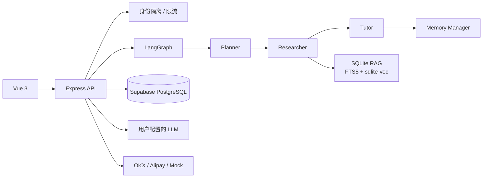
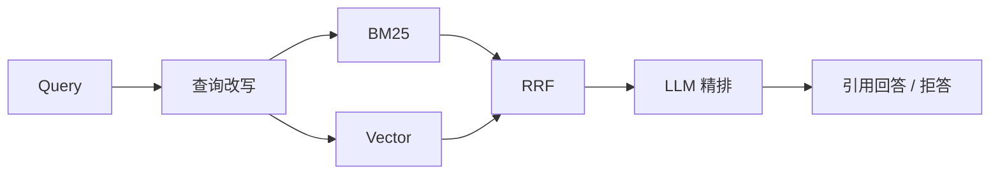

<div align="center">

# Japanese Word Master

日语学习 Agent：把查词、语法检索、例句、练习和间隔复习串成可追踪的学习闭环。

[](https://vuejs.org/)
[](https://expressjs.com/)
[](https://langchain-ai.github.io/langgraphjs/)
[](https://supabase.com/)
[](https://render.com/)
[](backend/tests)

[Live Demo](https://japanese-verb-master.onrender.com) · [维护手册](./docs/MAINTENANCE.md) · [Agent 开发规范](./AGENTS.md)

</div>

## 项目定位

这是一个垂直 Agentic RAG 应用，不只是动词变形页面：

- Vue 3 提供查词、复习、说明和变形道场。
- Express 暴露认证、Agent、知识库、练习和支付 API。
- LangGraph 编排 Planner、Researcher、Tutor 和 Memory Manager。
- SQLite + FTS5 + `sqlite-vec` 保存版本化词典与 RAG 索引。
- Supabase PostgreSQL 持久化账号、练习、SRS、Agent 记忆、运行记录和权益。
- Cloudflare Turnstile、接口限流和访客隔离保护公开 Demo。

## 核心能力

| 方向 | 实现 |
| --- | --- |
| Agent | LangGraph 多节点工作流、工具调用、SSE、运行历史与取消 |
| RAG | 查询改写、BM25 + Vector、RRF、LLM 精排、引用与拒答 |
| 学习 | 动词活用、场景练习、错题本、SM-2、学习画像 |
| 记忆 | SRS 复习卡与 Agent 长期记忆分离，均按用户隔离 |
| 用户 | 独立访客、注册升级、登录、Turnstile、分级限流 |
| 支付 | Mock、支付宝和 OKX provider；到账后按账户授予权益 |

## 架构



RAG 查询链路：



## 检索效果

当前黄金集包含 65 个域内问题和 10 个离题问题，知识库为 177 个语料块：

| 模式 | recall@1 | recall@5 | MRR | NDCG@10 |
| --- | ---: | ---: | ---: | ---: |
| BM25 | 47/65 | 58/65 | 0.798 | 0.832 |
| Vector | 51/65 | 63/65 | 0.855 | 0.883 |
| Hybrid | 57/65 | 63/65 | 0.914 | 0.931 |
| Hybrid + Rerank | **63/65** | **64/65** | **0.977** | **0.979** |

距离预过滤与 LLM gatekeeper 将对抗集离题幻觉率降至 0。完整轨迹见
[`backend/eval-history.jsonl`](./backend/eval-history.jsonl)。

## 本地运行

要求 Node.js 22。

```bash
git clone https://github.com/yuaiccc/japanese-verb-master.git
cd japanese-verb-master

cd backend
npm install
npm run dev

# 新终端
cd frontend
npm install
npm run dev
```

- 前端：<http://localhost:5173>
- 后端：<http://localhost:3456>
- 未配置外部 LLM 时可使用本地 Ollama。
- 浏览器填写的 LLM API Key 只保存在当前浏览器。

## 验证

日常开发按改动范围执行检查，不要求每次同时跑全部构建。具体规则见
[`AGENTS.md`](./AGENTS.md)。

```bash
cd backend && npm test
cd ../frontend && npm run build
```

## 生产部署

公开 Demo 使用 Render 单体部署。Vite 构建产物由 Express 同源托管，避免 SSE
跨域代理问题。

```text
DATABASE_URL
DATABASE_SSL
JVM_AUTH_SECRET
TURNSTILE_SITE_KEY
TURNSTILE_SECRET_KEY
```

用户数据位于 Supabase PostgreSQL；词典和 RAG 索引在构建期生成到 SQLite。
存储说明见 [`docs/postgres-storage.md`](./docs/postgres-storage.md)。

## OKX 支付

OKX provider 使用只读 Funding API 获取充值地址并查询充值记录：

```text
OKX_API_KEY
OKX_API_SECRET
OKX_API_PASSPHRASE
OKX_PAYMENT_CURRENCY=USDT
OKX_PAYMENT_CHAIN=USDT-TRC20
OKX_PAYMENT_AMOUNT=1
```

结算同时匹配 TxID、币种、网络、金额、地址、订单时间和 OKX 成功状态。同一
TxID 只能绑定一个订单。API Key 只应开启读取权限，禁止交易和提现权限。

该功能用于技术演示。公开提供真实数字资产收款前，应自行确认所在地区的合规、
税务和平台条款要求。

## 目录

```text
backend/
  knowledge/       RAG 构建、检索和评测
  payments/        支付 provider
  tests/           Node 测试
  server.ts        Express 与 Agent 入口
  userStore.ts     SQLite/PostgreSQL 存储适配
frontend/
  src/components/  Vue 组件
  src/composables/ 前端状态与业务流程
docs/              维护和集成文档
```

## 安全边界

- 不在仓库保存真实 API Key、密码、数据库 URL 或支付凭据。
- 所有用户数据接口必须使用服务端身份隔离。
- LLM BYOK 密钥保存在浏览器本地。
- OKX、Turnstile 和数据库凭据仅存在 Render 环境变量。
- 支付结果只由服务端 provider 核验，前端不能直接授予权益。

## License

[MIT](https://opensource.org/licenses/MIT)
