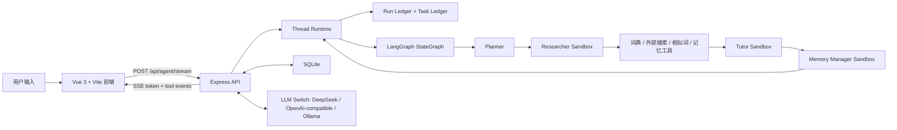
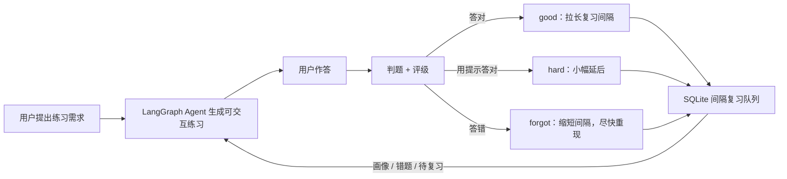
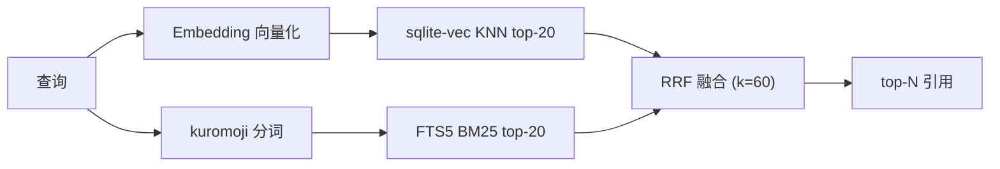

<div align="center">

# Japanese Word Master

### LangGraph 驱动的日语学习 Agent

[](https://vuejs.org/)
[](https://expressjs.com/)
[](https://langchain-ai.github.io/langgraphjs/)
[](https://www.sqlite.org/)
[](https://opensource.org/licenses/MIT)

[English](./README_EN.md) | [日本語](./README_JA.md)

</div>

---

Japanese Word Master 正在从传统“日语动词变形工具”升级为一个垂类日语学习 Agent。它保留了词典、动词活用、场景练习和记忆复习能力，同时引入 LangGraph 多阶段 Agent、可切换 LLM Provider、外部搜索、token 级流式输出，以及一套 thread / run / subagent runtime，让查词变成可解释、可追踪、可复习的学习闭环。

## 核心能力

- **LangGraph 多 Agent 工作流**：`Planner -> Researcher -> Tutor -> Memory Manager`，每一步都是真实 LangGraph 节点。
- **线程化运行时**：具备 `thread -> run -> subagent task` 三层结构，支持持久化 run 历史、subagent 任务账本、运行取消、thread 摘要和自动 compact。
- **流式 Agent 体验**：通过 SSE 实时推送 `queue`、`tool_start`、`tool_end`、`token`、`done` 事件，前端将工具过程压成回答区内的小胶囊，不抢占主视觉。
- **Thread 级上下文压缩**：根据 token 压力、对话长度和近期 run 数量动态选择 `none / light / standard / aggressive` compact 模式，自动保留主题、焦点词和练习焦点。
- **外部搜索与工具调用**：Agent 可调用外部搜索、Jisho/Wiktionary/Wikipedia 资料、本地词典、相似词推荐和记忆状态工具。
- **练习驱动的记忆闭环 ⭐**：Agent 生成的练习题是可交互的，作答结果会直接回流到长期记忆系统——答对延长复习间隔、答错缩短并尽快重现，练过但未入库的词会自动建卡。这是把「学」与「记」打通的核心创新点。
- **本地语法知识库（RAG）⭐**：约 80 条 N5–N2 语法/活用/助词/句型/敬语条目，sqlite-vec 向量检索 + FTS5 BM25 双路召回经 RRF 融合排序；content-hash 增量索引只对变更块重嵌入；embedding 不可用时自动降级纯 BM25。Agent 回答语法类问题时优先检索本地知识并在回答区展示引用卡片。
- **LLM Switch**：支持 DeepSeek、OpenAI、OpenRouter、SiliconFlow、Custom 和 Ollama 多 provider 快速切换。
- **日语词典与动词活用**：支持五段、一段、サ变、カ变动词，生成常用活用形式。
- **记忆卡片系统**：内置 SQLite 记忆卡、复习队列、到期提醒和可调复习参数。
- **场景练习**：按日常生活、点餐、学校、旅行、职场等场景练习高频动词。
- **深色模式与无障碍模式**：前端支持深色主题、无障碍显示偏好和响应式布局。

## 技术架构



更详细的维护说明、Agent 边界、SSE 协议和重构建议见 [维护手册](./docs/MAINTENANCE.md)。

## 线程化运行时

当前后端已经不只是“一个会调 LLM 的 API”，而是开始具备清晰的运行时分层：

- **Thread**：前端持久化一个稳定的 `threadId`，同一条学习线程下的历史 run、compact 摘要和学习主题会被聚合在一起。
- **Run**：每次提问都会创建一个持久化 `agent_run`，保存问题、状态、最终摘要、usage、compact 结果和 thread 元数据。
- **Subagent Task**：每个 `Researcher / Tutor / Memory Manager / Specialist` 都会创建独立 task，记录状态、sandbox policy、事件流、取消标记和时间戳。
- **Sandbox Policy**：不同 subagent 暴露不同的上下文切片、工具集合、token budget 和 timeout，开始从“看起来分工”走向“系统级真的分工”。
- **Compact / Thread Summary**：运行时会根据上下文压力做 thread 级摘要，把旧对话和最近 run 的重点收进 `compactSummary` 与 `threadSummary`，再注入下一轮上下文。

### 当前的 compact 模式

- `none`：上下文很短，保留近几轮原文
- `light`：轻量吸收最近历史 run，保留最近原文
- `standard`：压缩较早对话，并吸收最近几轮摘要
- `aggressive`：优先保留 thread digest、焦点词和练习焦点，减少旧原文

这套机制当前已经支持本地 thread 级摘要、上下文压缩和运行时持久化，后续会继续补强 thread resume、checkpoint 和更细粒度的 compact 策略。

## 练习驱动的记忆闭环

大多数日语工具把「查词解释」和「间隔复习」当成两个互不相通的功能。本项目把它们连成一条闭环：



- 当 Agent 识别到练习类请求时，会基于当前查词上下文构造一道带标准答案的活用练习题。
- 用户在回答区直接作答，后端判题后把结果映射为复习评级（`good` / `hard` / `forgot`）。
- 评级通过与 Anki 类似的 SM-2 变体算法更新记忆卡的 `ease`、`interval`、`due` 等字段，**错题会在约 20 分钟后重现，连续答对的词复习间隔逐步拉长**。
- 练过但尚未进入记忆库的词会自动建卡，纳入复习队列；学习画像（薄弱活用形、错题本）也会同步刷新，反过来指导后续练习。

这样每一次练习既是检测，也是一次记忆调度，真正把「学」和「记」打通。

## 本地语法知识库（RAG）

为语法/活用/助词/句型/敬语类问题提供本地可检索的教材语料，让 Agent 优先命中本地知识、减少对外部搜索和模型自身知识的依赖。

**检索链路**：query 经 embedding 适配层向量化、kuromoji 分词构造 FTS5 查询 → `knowledge_vec`（sqlite-vec KNN，向量召回语义近邻）与 `knowledge_fts`（FTS5 BM25，关键词精确命中）各取 top-20 → RRF（k=60）融合排序取 top-N。RRF 只用排名位置而非原始分，无需在异质的余弦距离与 BM25 分之间调权重。



**工程特性**：

- **增量索引**：每块算 SHA-256 content-hash，只对新增/变更块调用 embedding，构建成本 O(变更)；降级模式下入库的块在 embedding 恢复后会被自动补嵌。
- **降级设计**：embedding 服务不可用时自动降级纯 BM25，结果标记 `degraded: true`，Agent 流程不中断。
- **Provider 抽象**：embedding 支持 Ollama（默认 `bge-m3`）与 OpenAI 兼容接口（SiliconFlow 等）；检索后端通过 `rag_provider` 预留外部 RAG（如 RAGFlow）接入位。
- **Agent 集成**：`knowledge_search` 注册为 Researcher 首位工具（本地优先于 external_search）；Planner 前做一次轻量 background investigation 注入本地资料概览；回答区渲染知识库引用卡片。

### 构建与评测

```bash
cd backend
npm run kb:build          # 解析 knowledge-source/*.md，增量写入三表（无 Ollama 时自动 --no-embed 降级）
npm run kb:eval           # 用 golden-set.json 跑 recall@k / MRR，对照三种检索模式
```

embedding 配置存于 `app_settings`，也可在前端设置面板的「知识库检索 Embedding」处切换 provider / 模型 / Base URL / API Key。

### 检索质量基准

20 题黄金集（`backend/knowledge-source/golden-set.json`），embedding 模型 `qwen3-embedding:0.6b`：

| 模式 | recall@1 | recall@3 | recall@5 | MRR |
| --- | --- | --- | --- | --- |
| hybrid（向量 + BM25 + RRF） | 16/20 | 19/20 | **20/20** | 0.871 |
| vector（纯向量） | 18/20 | 19/20 | 20/20 | 0.929 |
| bm25（纯关键词） | 12/20 | 17/20 | 17/20 | 0.708 |

混合检索的 recall@5 达到满分且不低于任一单路（BM25 单路仅 17/20，会漏召）。该 embedding 模型语义能力很强，单路向量的 top-1 略高于混合——这正体现了 hybrid 的取舍：用少量 top-1 精度换取召回完备性与对弱语义、强关键词查询的鲁棒性。

### 后端

- Node.js + Express
- LangGraph JS (`@langchain/langgraph`)
- SQLite (`better-sqlite3`)
- DeepSeek API 优先，Ollama 可作为本地模型备用
- Jisho / Japanese Wiktionary / Japanese Wikipedia / DuckDuckGo Instant Answer 搜索

### 前端

- Vue 3 + Vite
- 单一 Agent 输入框
- Markdown 渲染
- SSE 流式读取
- Agent 队列、工具轨迹、记忆复习、场景练习工作台

## 快速开始

### 1. 克隆项目

```bash
git clone https://github.com/yuaiccc/japanese-verb-master.git
cd japanese-verb-master
```

### 2. 启动后端

```bash
cd backend
npm install

# 推荐：DeepSeek
export LLM_PROVIDER=deepseek
export DEEPSEEK_API_KEY=你的 DeepSeek API Key
export DEEPSEEK_MODEL=deepseek-v4-flash

npm run dev
```

后端默认运行在 `http://localhost:3456`。

如果不配置 DeepSeek，项目会尝试使用本地 Ollama：

```bash
export OLLAMA_MODEL=qwen2.5
npm run dev
```

> 除环境变量外，也可以在前端「设置」面板中切换 LLM Provider（DeepSeek / OpenAI / OpenRouter / SiliconFlow / Custom / Ollama）。切换 Provider 后需重新填写对应的 API Key，旧 Key 不会被跨 Provider 复用。API Key 以明文保存在本地 SQLite，请勿将含密钥的 `dictionary.db` 提交或公开。

### 3. 启动前端

```bash
cd frontend
npm install
npm run dev
```

前端默认运行在 `http://localhost:5173`。

## 主要 API

### LangGraph Agent 流式接口

```bash
curl -N -X POST http://localhost:3456/api/agent/stream \
  -H "Content-Type: application/json" \
  --data '{"message":"食べる 和 召し上がる 有什么区别？","context":{}}'
```

事件类型：

- `run_start`：本轮运行开始，包含 `runtime: "langgraph"`
- `runtime_state`：threadId、compactSummary、threadSummary 等正式运行时状态
- `queue`：当前 Agent 队列状态
- `agent_note`：节点状态说明
- `subagent_task`：子 Agent task 生命周期事件（started / completed / cancelled / timed_out / failed）
- `tool_start`：工具开始调用
- `tool_end`：工具调用完成
- `token`：Tutor 流式回答片段
- `done`：本轮完成

`done` 事件中除最终回答外，还会带回 `examples`（结构化例句卡）、`memoryCandidates`（推荐记忆词）、`interactivePractice`（可交互练习题）和 `knowledgeSources`（本地知识库引用条目）。

### 本地知识库接口

```bash
# 直接检索（调试 / 演示）
curl "http://localhost:3456/api/knowledge/search?q=て形怎么变&topK=5"

# 索引状态与 embedding 配置
curl "http://localhost:3456/api/knowledge/stats"

# 触发增量重建（异步防抖队列）
curl -X POST "http://localhost:3456/api/knowledge/reindex"
```

另有条目 CRUD（`POST/DELETE /api/knowledge/chunks`）与 embedding 设置（`GET/POST /api/knowledge/embedding-settings`）接口，写入后经防抖队列异步重嵌、不阻塞请求。

### Run / Thread 查询接口

```bash
# 查看当前 thread 的 run 历史
curl "http://localhost:3456/api/agent-runs?threadId=your-thread-id&limit=10"

# 查看某一轮 run 的详情
curl "http://localhost:3456/api/agent-runs/your-run-id"

# 查看某一轮 run 下的 subagent tasks
curl "http://localhost:3456/api/subagent-tasks?runId=your-run-id"

# 查看当前 thread 的摘要
curl "http://localhost:3456/api/agent-thread-summary?threadId=your-thread-id"

# 取消某一轮 run
curl -X POST "http://localhost:3456/api/agent-runs/your-run-id/cancel"
```

### 交互练习判题接口（记忆闭环）

```bash
curl -X POST http://localhost:3456/api/dojo-agent-turn \
  -H "Content-Type: application/json" \
  --data '{
    "action": "check",
    "recordToMemory": true,
    "hintUsed": false,
    "userAnswer": "食べて",
    "question": {
      "verb": "食べる", "reading": "たべる", "verbType": "ICHIDAN",
      "formKey": "teForm", "formLabel": "て形", "answer": "食べて"
    }
  }'
```

当 `recordToMemory` 为 `true` 时，判题结果会写入练习记录、更新（或新建）记忆卡，并在响应的 `memory` 字段中返回评级、最新卡片、整张卡表和刷新后的学习画像。`action: "hint"` 则返回一条解题提示。

### 动词活用接口

```bash
curl "http://localhost:3456/api/conjugate?verb=食べる&type=ICHIDAN"
```

示例返回：

```json
{
  "dictionaryForm": "食べる",
  "verbType": "ICHIDAN",
  "negative": "食べない",
  "polite": "食べます",
  "teForm": "食べて",
  "taForm": "食べた",
  "potential": "食べられる",
  "passive": "食べられる",
  "causative": "食べさせる",
  "imperative": "食べろ",
  "volitional": "食べよう"
}
```

## Agent 工具

当前 LangGraph Researcher 节点可调用：

- `knowledge_search`：检索本地语法知识库（混合检索 + RRF），语法/活用/助词/句型/敬语类问题优先调用
- `lookup_word`：本地词典优先，必要时回退到 Jisho
- `external_search`：检索日语语法、词义、例句和外部资料
- `recommend_similar`：基于同场景、词形和语义推荐相似词
- `memory_status`：读取记忆卡、到期复习和学习画像
- `add_memory_card`：加入或更新记忆卡片

## 动词分类支持

1. **五段动词**：例 `飲む`、`書く`
2. **一段动词**：例 `食べる`、`見る`
3. **サ变动词**：例 `勉強する`
4. **カ变动词**：`来る`

## 开发命令

```bash
# 前端构建
cd frontend
npm run build

# 后端语法检查
cd backend
node --check server.js

# 后端单元测试（node:test）
npm test

# 构建 / 评测本地知识库
npm run kb:build
npm run kb:eval
```

## 路线图

- [x] 练习结果回流长期记忆系统（间隔复习闭环）
- [x] 本地语法知识库（sqlite-vec + FTS5 混合检索 + RRF + recall/MRR 评测）
- [x] run / subagent task ledger
- [x] Thread 级 compact 与摘要注入
- [ ] 更完整的 thread resume / thread 切换
- [ ] LangGraph checkpoint / 更细粒度 thread 持久化
- [ ] 更完整的 Agent 工具注册与动态扩展
- [ ] 多用户隔离的长期记忆和学习画像
- [ ] 更细的敬语、谦让语、语境判断
- [ ] 移动端复习体验优化

## 开源协议

本项目基于 **MIT License** 开源。

---

<div align="center">
如果这个项目对你有帮助，欢迎点一个 Star。
</div>
