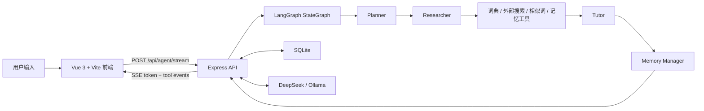

<div align="center">

# Japanese Word Master

### LangGraph 驱动的日语学习 Agent

[](https://vuejs.org/)
[](https://expressjs.com/)
[](https://langchain-ai.github.io/langgraphjs/)
[](https://www.sqlite.org/)
[](https://opensource.org/licenses/MIT)

[English](./README_EN.md) | [日本語](./README_JA.md)

</div>

---

Japanese Word Master 正在从传统“日语动词变形工具”升级为一个垂类日语学习 Agent。它保留了词典、动词活用、场景练习和记忆复习能力，同时引入 LangGraph 多阶段 Agent、DeepSeek LLM、外部搜索和 token 级流式输出，让查词变成可解释、可追踪、可复习的学习闭环。

## 核心能力

- **LangGraph 多 Agent 工作流**：`Planner -> Researcher -> Tutor -> Memory Manager`，每一步都是真实 LangGraph 节点。
- **流式 Agent 体验**：通过 SSE 实时推送 `queue`、`tool_start`、`tool_end`、`token`、`done` 事件。
- **外部搜索与工具调用**：Agent 可调用外部搜索、Jisho/Wiktionary/Wikipedia 资料、本地词典、相似词推荐和记忆状态工具。
- **日语词典与动词活用**：支持五段、一段、サ变、カ变动词，生成常用活用形式。
- **记忆卡片系统**：内置 SQLite 记忆卡、复习队列、到期提醒和可调复习参数。
- **场景练习**：按日常生活、点餐、学校、旅行、职场等场景练习高频动词。
- **深色模式与无障碍模式**：前端支持深色主题、无障碍显示偏好和响应式布局。

## 技术架构



### 后端

- Node.js + Express
- LangGraph JS (`@langchain/langgraph`)
- SQLite (`better-sqlite3`)
- DeepSeek API 优先，Ollama 可作为本地模型备用
- Jisho / Japanese Wiktionary / Japanese Wikipedia / DuckDuckGo Instant Answer 搜索

### 前端

- Vue 3 + Vite
- 单一 Agent 输入框
- Markdown 渲染
- SSE 流式读取
- Agent 队列、工具轨迹、记忆复习、场景练习工作台

## 快速开始

### 1. 克隆项目

```bash
git clone https://github.com/yuaiccc/japanese-verb-master.git
cd japanese-verb-master
```

### 2. 启动后端

```bash
cd backend
npm install

# 推荐：DeepSeek
export LLM_PROVIDER=deepseek
export DEEPSEEK_API_KEY=你的 DeepSeek API Key
export DEEPSEEK_MODEL=deepseek-v4-flash

npm run dev
```

后端默认运行在 `http://localhost:3456`。

如果不配置 DeepSeek，项目会尝试使用本地 Ollama：

```bash
export OLLAMA_MODEL=qwen2.5
npm run dev
```

### 3. 启动前端

```bash
cd frontend
npm install
npm run dev
```

前端默认运行在 `http://localhost:5173`。

## 主要 API

### LangGraph Agent 流式接口

```bash
curl -N -X POST http://localhost:3456/api/agent/stream \
  -H "Content-Type: application/json" \
  --data '{"message":"食べる 和 召し上がる 有什么区别？","context":{}}'
```

事件类型：

- `run_start`：本轮运行开始，包含 `runtime: "langgraph"`
- `queue`：当前 Agent 队列状态
- `agent_note`：节点状态说明
- `tool_start`：工具开始调用
- `tool_end`：工具调用完成
- `token`：Tutor 流式回答片段
- `done`：本轮完成

### 动词活用接口

```bash
curl "http://localhost:3456/api/conjugate?verb=食べる&type=ICHIDAN"
```

示例返回：

```json
{
  "dictionaryForm": "食べる",
  "verbType": "ICHIDAN",
  "negative": "食べない",
  "polite": "食べます",
  "teForm": "食べて",
  "taForm": "食べた",
  "potential": "食べられる",
  "passive": "食べられる",
  "causative": "食べさせる",
  "imperative": "食べろ",
  "volitional": "食べよう"
}
```

## Agent 工具

当前 LangGraph Researcher 节点可调用：

- `lookup_word`：本地词典优先，必要时回退到 Jisho
- `external_search`：检索日语语法、词义、例句和外部资料
- `recommend_similar`：基于同场景、词形和语义推荐相似词
- `memory_status`：读取记忆卡、到期复习和学习画像
- `add_memory_card`：加入或更新记忆卡片

## 动词分类支持

1. **五段动词**：例 `飲む`、`書く`
2. **一段动词**：例 `食べる`、`見る`
3. **サ变动词**：例 `勉強する`
4. **カ变动词**：`来る`

## 开发命令

```bash
# 前端构建
cd frontend
npm run build

# 后端语法检查
cd backend
node --check server.js
```

## 路线图

- LangGraph checkpoint / thread 持久化
- 更完整的 Agent 工具注册与动态扩展
- 用户级长期记忆和学习画像
- 更细的敬语、谦让语、语境判断
- 移动端复习体验优化

## 开源协议

本项目基于 **MIT License** 开源。

---

<div align="center">
如果这个项目对你有帮助，欢迎点一个 Star。
</div>
