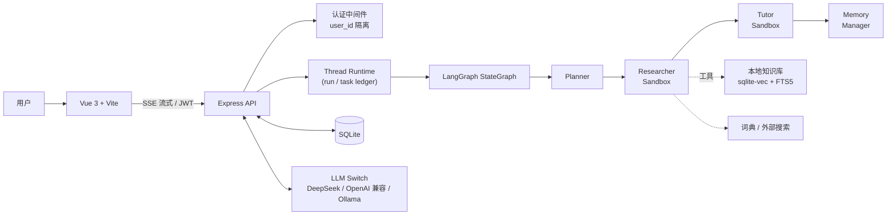
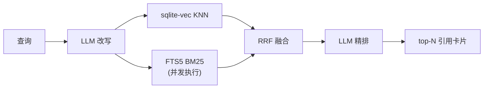

<div align="center">

# 🇯🇵 Japanese Word Master

**LangGraph 驱动的日语学习 Agent —— 把「查词」变成可解释、可追踪、可复习的学习闭环**

[](https://vuejs.org/)
[](https://expressjs.com/)
[](https://langchain-ai.github.io/langgraphjs/)
[](https://www.sqlite.org/)
[](backend/tests)
[](https://opensource.org/licenses/MIT)

[维护手册](./docs/MAINTENANCE.md)

</div>

---

## ✨ 三大核心设计

### 1️⃣ 本地 RAG：三段式检索 + 防幻觉生成

约 180 条 N5–N1 语法语料（活用/助词/句型/敬语/形容词/辨析/副词接续/量词/拟声拟态），**查询改写 → 并发混合召回 → RRF 融合 → LLM 精排** 全链路本地化，每个旋钮都有可量化的优化前后对比（80 条语料 / 50 题集时实测）：

| 优化实验 | 指标 | 前 → 后 |
| --- | --- | --- |
| LLM 查询改写（口语 → 术语） | recall@1 / MRR | **41/50 → 49/50** ／ **0.870 → 0.990** |
| LLM 精排（三段式收尾） | recall@1 / MRR | 42/50 → 48/50 ／ 0.881 → 0.967 |
| abstain 双闸门（距离预过滤 + gatekeeper） | 离题幻觉率 ／ 拒答率 | **10.7% → 0%** ／ **0 → 100%** |
| 强制逐句引用 | 引用覆盖率 | 87.2% → 90.3% |

### 2️⃣ 练习驱动的记忆闭环

Agent 生成的练习题可直接作答，判题结果实时回流 SM-2 间隔复习系统——**答对拉长间隔、答错 20 分钟后重现、练过未入库的词自动建卡**。「学」与「记」不再是两个孤立功能。

### 3️⃣ 真实的多 Agent 运行时

`Planner → Researcher → Tutor → Memory Manager` 是真实 LangGraph 节点，具备 **thread / run / subagent task** 三层持久化、sandbox 策略隔离（工具白名单、token 预算、超时）、SSE 全程流式、可折叠的执行过程时间线，以及按上下文压力自动选择的 4 档 compact 摘要。

---

## 🏗 架构总览



**RAG 检索链路**（Researcher 的 `knowledge_search` 工具内部）：



---

## 🚀 快速开始

```bash
git clone https://github.com/yuaiccc/japanese-verb-master.git
cd japanese-verb-master

# 后端（默认 http://localhost:3456）
cd backend && npm install
export LLM_PROVIDER=deepseek DEEPSEEK_API_KEY=sk-xxx   # 或不配置，回退本地 Ollama
npm run dev

# 前端（默认 http://localhost:5173）
cd ../frontend && npm install && npm run dev
```

> 💡 LLM Provider（DeepSeek / OpenAI / OpenRouter / SiliconFlow / Custom / Ollama）与知识库 Embedding 均可在前端设置面板热切换。API Key 明文存于本地 SQLite，请勿提交 `dictionary.db`。

### 知识库构建与评测

```bash
cd backend
npm run kb:build          # 解析语料增量入库（无 embedding 服务时自动降级纯 BM25）
npm run kb:eval           # 50 题 golden-set：recall@k / MRR / NDCG@10 × 四档检索对比
npm run kb:eval:answer    # 端到端答案质量：引用覆盖率 / 忠实度 / 幻觉率 / 拒答率
npm run kb:tune           # RRF-k 扫描；KB_TUNE_REWRITE=1 加跑查询改写对比
npm test                  # 58 个单元测试
```

---

## 📊 检索质量基准

177 条语料 / 65 题黄金集（含大量口语化提问，支持多可接受答案）+ 10 题离题对抗集，embedding `qwen3-embedding:0.6b`：

| 检索模式 | recall@1 | recall@5 | MRR | NDCG@10 |
| --- | --- | --- | --- | --- |
| BM25（纯关键词） | 47/65 | 58/65 | 0.798 | 0.832 |
| Vector（纯向量） | 51/65 | 63/65 | 0.855 | 0.883 |
| Hybrid（RRF 融合） | 57/65 | 63/65 | **0.914** | 0.931 |
| **Hybrid + Rerank（三段式）** | **63/65** | **64/65** | **0.977** | **0.979** |

**误差分析驱动的迭代**：逐题分析 hybrid 未进 top1 的 12 道题后分两类处理——4 题属评测口径问题（top1 实为同主题合理条目，如「一边做」命中「〜つつ」而非「ながら」），纳入多可接受答案；真实失败则用 FTS5 标题列加权（w=2，标题即语法点名称）小幅修正。两项叠加：hybrid MRR 0.877 → 0.914，精排后 0.951 → **0.977**。完整指标轨迹见 `backend/eval-history.jsonl`。

**语料扩容回归分析**：语料从 80 → 177 条（2.2×）后，纯向量 MRR 从 0.887 跌至 0.855——新增的「辨析」类条目与原条目语义高度相近，干扰了向量近邻；而 Hybrid 稳住并**反超纯向量**（80 条时 hybrid 0.881 < vector 0.887；扩容后 hybrid 0.914 > vector 0.855）。混合检索的鲁棒性正是在更大、更密的语料上才显现——这也是小规模 demo 测不出来的工程结论。

端到端生成侧用 LLM-judge 将答案拆成原子陈述逐条溯源（借鉴 RAGAS faithfulness）：abstain 双闸门的距离阈值（1.0）由实测分布定出——域内查询最近邻距离 < 0.94、离题 > 1.06，干净可分。

---

## 🧰 功能全景

| 分类 | 能力 |
| --- | --- |
| **学习** | 五段/一段/サ变/カ变动词活用 · 场景练习（点餐/旅行/职场…） · SM-2 记忆卡与复习队列 · 学习画像与错题本 |
| **Agent** | 多节点 LangGraph 工作流 · 6 个工具（本地知识库优先） · SSE 流式 + 可折叠执行轨迹 · run 取消 / 历史回放 |
| **RAG** | 三段式检索 · content-hash 增量索引 · embedding 挂掉自动降级 BM25 · 检索打点（延迟 p50/p95、降级率）`GET /api/knowledge/metrics` |
| **用户系统** | 注册 / 登录（scrypt 密码哈希 + HMAC token，零依赖） · 记忆卡 / 练习记录 / 付费权益按 `user_id` 隔离 · 未登录回退访客账号（向后兼容） |
| **支付** | 支付宝 SDK v4 接入 · 电脑网站支付（page）/ 当面付（qr）双模式可切换 · 半配置自动回退 mock · `user_id` 维度的订单与权益隔离 |
| **运行时** | thread→run→task 三层持久化 · sandbox 策略（白名单/预算/超时） · 4 档自适应 compact 摘要 |
| **体验** | 深色模式 · 无障碍模式 · 知识库引用卡片（可展开全文） · 回答区模块导航轨 |

---

## 💳 支付集成现状（诚实说明）

「N1 专项练习」是一个**付费解锁**的 demo，演示「应用开单 → 用户确认 → 到账解锁权益」的 A2A 支付形态。代码层完整实现了**两个 provider**：

- **mock provider**（默认，零配置）：完整业务闭环（开单 / 状态 / 解锁权益），点击"模拟扫码支付"即解锁，**直接可玩**。
- **alipay provider**（填入 `.env` 三件套即启用）：基于 `alipay-sdk` v4 接入支付宝当面付 / 电脑网站支付，沙箱已实测**HTTP 层端到端打通**——`pageExecute` 生成的 `payUrl` 携带合法 RSA2 签名、`302` 重定向到沙箱真实收银台入口 `unitradeprod-sandbox.dl.alipaydev.com/appAssign.htm`。

### ⚠️ 但沙箱完整闭环走不下来——支付宝沙箱基础设施限制

实际测试发现支付宝**沙箱网页登录页**（`auth-sandbox.dl.alipaydev.com/login`）**不识别沙箱买家账号**，会把浏览器踢回真实支付宝登录页（`auth.alipay.com`）。开放平台官方说明印证了这一点：

> 「沙箱钱包**暂时仅支持 Android**」「沙箱付款必须使用**沙箱版支付宝 App**」

也就是说，**沙箱付款的最终一步（输入支付密码）只有安卓 App 通道**。如果开发者：① 没有安卓机、② 也不想装 Android 模拟器，整条沙箱付款流就走不通——卡点不在代码、不在密钥、不在签名，而在支付宝沙箱本身。

### 这个项目的处理

- 默认走 mock provider，演示/作品集完全可用，零资金风险
- alipay provider 保留并完整接入，开发者一旦有了正式商户资质或安卓沙箱设备就能直接切上去（密钥替换、删 `ALIPAY_ENDPOINT` 即可）
- 上线生产前需要：① 商户入驻并签约对应支付产品 ② 设置强随机 `AUTH_SECRET` ③ 监管合规（结算需个体工商户/营业执照起步）

### 写在最后

接入支付的工程量不大，但每一项**资质 / 合规 / 沙箱政策 / 真机要求**都可能成为业余项目无法跨越的现实门槛。把这一段如实写出来，比塞个"已对接支付宝"的伪卖点更对得起读者。

---

## 📡 API 速览

<details>
<summary><b>Agent 流式对话</b>（SSE）</summary>

```bash
curl -N -X POST http://localhost:3456/api/agent/stream \
  -H "Content-Type: application/json" \
  --data '{"message":"食べる 和 召し上がる 有什么区别？","context":{}}'
```

事件序列：`run_start` → `runtime_state` → `queue` → `agent_note` → `subagent_task` → `tool_start/tool_end` → `token`… → `done`。

`done` 附带 `examples`（结构化例句）、`interactivePractice`（可交互练习）、`memoryCandidates`（推荐记忆词）、`knowledgeSources`（知识库引用）。

</details>

<details>
<summary><b>用户认证</b></summary>

```bash
# 注册（返回 token）
curl -X POST http://localhost:3456/api/auth/register \
  -H "Content-Type: application/json" \
  --data '{"username":"alice","password":"secret123"}'

# 登录
curl -X POST http://localhost:3456/api/auth/login \
  -H "Content-Type: application/json" \
  --data '{"username":"alice","password":"secret123"}'

# 当前用户（带 token）
curl http://localhost:3456/api/auth/me -H "Authorization: Bearer <TOKEN>"
```

后续请求带 `Authorization: Bearer <TOKEN>`，记忆卡 / 练习 / 权益即按该用户隔离；不带 token 则归访客（默认用户）。生产环境请设置 `AUTH_SECRET` 环境变量。

</details>

<details>
<summary><b>本地知识库</b></summary>

```bash
curl "http://localhost:3456/api/knowledge/search?q=て形怎么变&topK=5"   # 直接检索
curl "http://localhost:3456/api/knowledge/stats"                        # 索引状态
curl "http://localhost:3456/api/knowledge/metrics"                      # 检索可观测指标
curl -X POST "http://localhost:3456/api/knowledge/reindex"              # 增量重建（防抖队列）
```

另有条目 CRUD（`POST/DELETE /api/knowledge/chunks`）与 embedding 设置接口。

</details>

<details>
<summary><b>Run / Thread 运行时</b></summary>

```bash
curl "http://localhost:3456/api/agent-runs?threadId=xxx&limit=10"   # run 历史
curl "http://localhost:3456/api/agent-runs/run-id"                  # run 详情
curl "http://localhost:3456/api/subagent-tasks?runId=run-id"        # 子任务账本
curl "http://localhost:3456/api/agent-thread-summary?threadId=xxx"  # thread 摘要
curl -X POST "http://localhost:3456/api/agent-runs/run-id/cancel"   # 取消运行
```

</details>

<details>
<summary><b>练习判题</b>（记忆闭环入口）与<b>动词活用</b></summary>

```bash
# 判题并回流记忆系统
curl -X POST http://localhost:3456/api/dojo-agent-turn \
  -H "Content-Type: application/json" \
  --data '{"action":"check","recordToMemory":true,"userAnswer":"食べて",
    "question":{"verb":"食べる","verbType":"ICHIDAN","formKey":"teForm","answer":"食べて"}}'

# 动词活用
curl "http://localhost:3456/api/conjugate?verb=食べる&type=ICHIDAN"
```

</details>

---

## 🗺 路线图

- [x] 练习结果回流长期记忆（间隔复习闭环）
- [x] 本地 RAG：三段式检索 + NDCG/忠实度/幻觉率评测体系
- [x] run / subagent task ledger + thread 级 compact
- [x] SSE 执行过程可观测（折叠时间线）
- [x] 用户账号 + 多用户数据隔离（记忆卡 / 练习 / 付费权益；Agent 内部隔离进行中）
- [x] 支付宝 SDK 接入（mock + alipay 双 provider；沙箱受基础设施限制见上文）
- [ ] thread resume / LangGraph checkpoint
- [ ] GraphRAG：语法点知识图谱检索腿（活用派生关系、助词混淆对）
- [ ] 完整线上付费链路（需商户资质 + 实名结算账户）
- [ ] 移动端复习体验优化

## 📄 License

[MIT](https://opensource.org/licenses/MIT)

---

<div align="center">

**如果这个项目对你有帮助，欢迎点一个 ⭐️**

</div>
