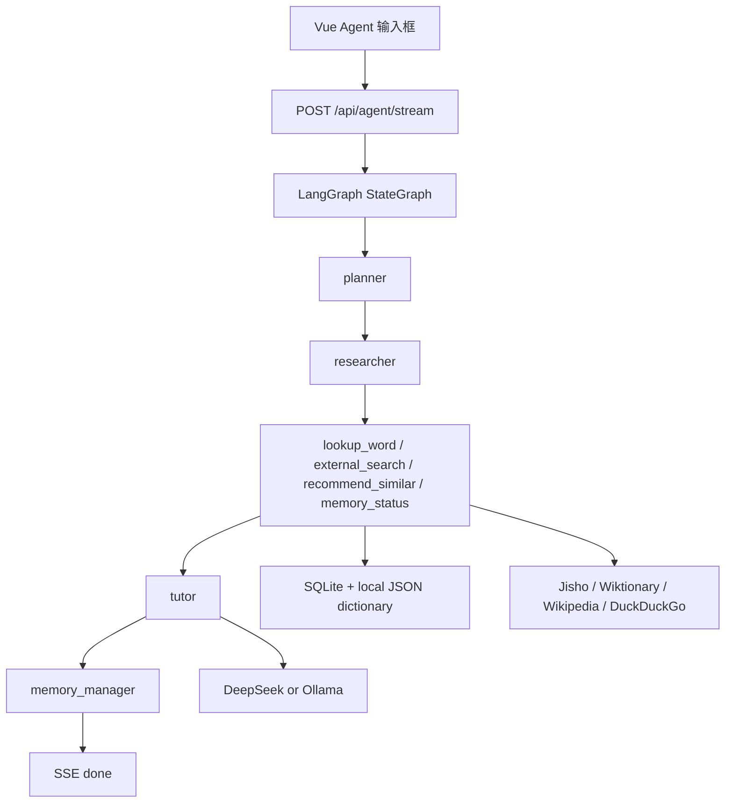

# Japanese Word Master 维护手册

最后更新：2026-05-30

这份文档用于维护项目架构、核心逻辑和排障流程。每次引入新能力、改动 Agent 流程、调整数据库结构或改变前端主流程，都应该同步更新这里。

## 当前产品定位

Japanese Word Master 不再只是“动词变形查询器”。当前定位是：

> 以单一 Agent 输入框为入口的日语学习工作台。

它包含三层能力：

1. **基础语言工具层**：词典查询、动词活用、furigana、场景练习。
2. **学习记忆层**：记忆卡片、复习队列、复习参数、练习画像。
3. **Agent 编排层**：LangGraph 多节点流程、工具调用、外部搜索、流式回答。

## Agent 到底解决什么问题

Agent 的作用不是替代词典，也不是把所有功能都包成聊天窗口。它负责把多个学习工具串起来，形成一次完整学习任务。

输入：

- 一个日语词，例如 `食べる`
- 一个比较问题，例如 `食べる 和 召し上がる 有什么区别？`
- 一个学习请求，例如 `帮我安排今天复习`

Agent 应该做：

- 判断需要哪些工具。
- 调本地词典、外部搜索、相似词、记忆状态。
- 把工具结果组织成学习解释。
- 给出下一步练习或记忆动作。

Agent 不应该做：

- 绕过已有词典/活用引擎直接瞎编答案。
- 把原始 JSON、工具日志直接暴露给用户。
- 让用户等待很久但页面没有任何反馈。
- 把传统 UI 全部塞进聊天框，导致产品不可维护。

## 全链路结构



## 后端核心文件

### `backend/server.ts`

目前过大，是主要混乱来源。它同时包含：

- Express app 和 API routes
- LLM provider 封装和 LLM Switch
- Agent tools
- LangGraph StateGraph
- SSE 输出
- AI explain
- suggest / conjugate / dojo / memory APIs

短期先不要盲目拆文件，避免破坏功能。下一次重构建议按下面顺序拆：

1. `agent/graph.ts`：`LearningAgentState` 和 `createLearningAgentGraph`
2. `agent/tools.ts`：`agentTools`、`executeAgentTool`
3. `agent/sse.ts`：`prepareSse`、`writeSse`、`emitAgentQueue`
4. `llm/provider.ts`：LLM Switch、OpenAI-compatible 调用和 Ollama 调用
5. `routes/*.ts`：按 memory、dojo、dictionary、agent 拆路由

### `backend/db.ts`

负责 SQLite：

- 练习记录
- 记忆卡片
- 记忆参数
- 相似词查询所需词库

### `backend/sceneData.ts`

维护场景练习分类，例如日常、点餐、学校、旅行、职场。

## LangGraph 节点

当前图：

```text
START -> planner -> researcher -> tutor -> memory_manager -> END
```

### planner

职责：

- 发出规划状态。
- 给 Researcher/Tutor 一个固定任务计划。

当前没有调用 LLM，因为第一次实践证明额外 planner LLM 调用会让首屏等待变慢。

### researcher

职责：

- 从用户输入抽取日语词。
- 并发调用工具。
- 把工具结果转成上下文消息给 Tutor。

当前工具：

- `lookup_word`
- `external_search`
- `recommend_similar`
- `memory_status`

维护注意：

- 工具必须容错。单个工具失败不能让整轮 SSE 失败。
- 工具结果可以进入 LLM 上下文，但前端展示必须解析为人类可读摘要。

### tutor

职责：

- 基于工具结果生成最终学习解释。
- 通过 SSE `token` 事件流式输出。

维护注意：

- 如果 DeepSeek 超时，必须 fallback 到基于工具结果的本地摘要。
- 第一枚 token 到来前，前端应该显示 queue/tool 进度，不允许空白等待。

### memory_manager

职责：

- 刷新记忆状态。
- 发出当前卡片数量、待复习数量、稳定数量。

## SSE 协议

接口：`POST /api/agent/stream`

事件：

- `run_start`：运行开始，包含 `runtime: "langgraph"`
- `queue`：节点队列状态
- `agent_note`：节点说明
- `tool_start`：工具开始
- `tool_end`：工具结束
- `token`：最终回答片段
- `done`：完成
- `error`：错误

前端必须做到：

- 收到 `run_start` 或 `queue` 就立刻显示反馈。
- 收到 `tool_start/tool_end` 就更新进度，不显示原始 JSON。
- 收到第一枚 `token` 后清掉占位文字，切成正式回答。
- 收到 `done` 后取消 reader，释放状态，允许下一次查询。
- 工具过程只作为回答区内的小胶囊实时穿插出现，底部只保留轻量折叠详情，不能抢主视觉。

## LLM Switch

借鉴 `farion1231/cc-switch` 的 provider preset、API Key、Base URL、Model 快速切换思路，但只迁入本项目需要的 Web 版能力。

接口：

- `GET /api/llm-status`：返回当前 provider、model、baseUrl 和 `apiKeySet`。
- `GET /api/llm-settings`：返回可展示配置，不返回明文 API Key。
- `POST /api/llm-settings`：保存 provider、model、baseUrl 和可选 API Key。

当前支持：`deepseek`、`openai`、`openrouter`、`siliconflow`、`custom`、`ollama`。

安全边界：

- API Key 存在本地 SQLite `app_settings.llm_settings`，不下发明文到前端。
- 如果请求未带 `apiKey`，后端保留已有 key。
- 环境变量 `DEEPSEEK_API_KEY` 优先于本地设置，方便本地开发临时覆盖。

## 前端核心逻辑

### `frontend/src/App.vue`

目前也过大，包含：

- Agent 输入框和流式消息
- 工具轨迹
- 记忆卡片和参数
- 词典结果
- AI explain
- dojo 练习
- 大量 CSS

下一次重构建议拆：

1. `components/AgentPanel.vue`
2. `components/AgentRuntime.vue`
3. `components/ToolTrace.vue`
4. `components/MemoryQueue.vue`
5. `components/DojoPanel.vue`
6. `composables/useAgentStream.ts`
7. `composables/useMemoryCards.ts`

## 旧逻辑和新逻辑的关系

### 旧词典/活用逻辑仍然有价值

保留：

- `/api/conjugate`
- `/api/suggest`
- `/api/ai-explain`
- `/api/dojo-quiz`

它们是 Agent 的工具基础，也是非聊天式功能的底座。

### 新 Agent 逻辑是主入口

用户主输入框现在不再只接受具体日语单词。所有提交默认走 `/api/agent/stream`。

快捷按钮只是辅助：

- 查词：聚焦输入框
- 练习：切换 dojo
- 复习：显示记忆卡
- 参数：显示记忆设置

## 当前已知风险

- `server.ts` 和 `App.vue` 文件过大，后续维护成本高。
- LangGraph 目前没有 checkpoint/thread 持久化。
- Researcher 的工具选择目前是规则式 planned tools，不是 LLM 自主规划。
- 外部搜索依赖第三方 API，速度和稳定性不可完全控。
- 前端还没有完整 E2E 测试，只靠手动浏览器检查和 API smoke test。

## 全链路检查清单

每次改 Agent、SSE、前端输入框、工具调用后都跑：

```bash
cd backend
npx tsx --check server.ts

cd ../frontend
npm run build
```

本地服务：

```bash
cd backend
export LLM_PROVIDER=deepseek
export DEEPSEEK_API_KEY=你的 key
export DEEPSEEK_MODEL=deepseek-v4-flash
npm start

cd ../frontend
npm run dev
```

API smoke test：

```bash
curl -sS http://localhost:3456/health
curl -sS http://localhost:3456/api/llm-status
curl -sS "http://localhost:3456/api/conjugate?verb=食べる&type=ICHIDAN"
```

SSE smoke test：

```bash
curl -N -X POST http://localhost:3456/api/agent/stream \
  -H "Content-Type: application/json" \
  --data '{"message":"食べる 和 召し上がる 有什么区别？","context":{}}'
```

预期：

- 首包应在 1 秒内到达。
- 必须出现 `run_start`。
- 必须出现多个 `queue`。
- 必须出现 `tool_start` 和 `tool_end`。
- 必须出现多个 `token`。
- 最后必须出现 `done`。

## 2026-05-30 维护记录

### 已完成

- 引入 `@langchain/langgraph`。
- 将手写多阶段流程改为真实 `StateGraph`。
- 保持 SSE 协议兼容。
- 前端显示 `LangGraph · DeepSeek · deepseek-v4-flash`。
- 修复 SSE 体感不明显问题：前端增加即时占位反馈。
- Researcher 工具改为并发执行。
- 修复单工具失败导致整轮失败的风险。
- 修复断连后继续写 SSE 的风险。
- 修复旧请求 abort 覆盖新请求状态的风险。

### 最近验证

- `npx tsx --check backend/server.ts` 通过。
- `npm run build` 通过。
- `/health` 正常。
- `/api/conjugate` 正常。
- `/api/llm-status` 正常。
- `/api/memory-cards` 正常。
- `/api/agent/stream` 连续两轮正常，`runtime=langgraph`，有 `done`。
- 浏览器页面无 console error/warning。

## 下一步建议

1. 先拆 `backend/server.ts`，把 Agent 相关逻辑独立出去。
2. 再拆 `frontend/src/App.vue`，把 Agent 和 Memory/Dojo 分离。
3. 加一个最小 E2E：输入词语后断言出现 queue/tool/token/done。
4. 引入 LangGraph checkpoint/thread，让学习会话可恢复。
5. 把 Researcher 从规则式工具计划升级为“LLM 规划 + 工具白名单 + 超时兜底”。
